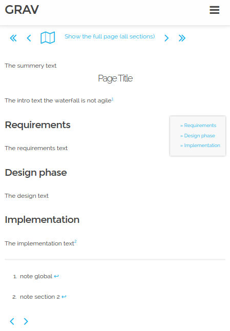
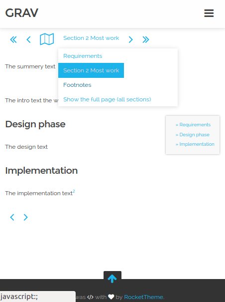

# [Grav SectionWidget Plugin][project]

## About

`SectionWidget` is a plugin for [**Grav**](http://getgrav.org).
This readme describes version 0.1.2.
The plugin splits, with special _section marker_, large content into sections.
The content of a section is up to the author.
It creates a configurable HTML widget that lets one navigate to the first, previous, next or last section.
Or a drop down menu that jumps directly into a specific section.
Only one section or all sections are visible at a time.
The widget layout is done with a partial twig template.
The included CSS styling fits well with the antimatter theme.

Your reasons for splitting content into sections might be:
* To make the content more digestible
* Your readers might prefer to peek into the conclusion first
* The content type makes clicking next, next, next ... more natural (e.g. a series of lyrics)
* ...

These screen shots gives you an idea how this might look like. The page is opened with all sections visible.
<a name="screenshot">

Here section two is selected. The pull down menu highlights the active section.

</a>


### Requirements

FontAwesome 4.4.0 is used for showing the "full" control in the widget
(to get around, change the icon `fa-map-o` in 
[templates/sectionwidget.html.twig](templates/partials/sectionwidget.html.twig))


## Issues

Please open a new [issue][issues] for defects or new functionality requests.


### Known limitations

Here are some limitation:

* You can only have one section widget per page
  (so it does not make much sense for modular pages).
* The section plugin does not integrate perfectly with the similar named
  [GroupWidget](https://github.com/aptly-io/grav-plugin-groupwidget) plugin.
* Sections don't open up automatically when selecting a link inside these from the
  [TOC](https://github.com/sommerregen/grav-plugin-toc/blob/master/README.md) plugin.


## Installation and Updates

There's a manual install and update method by downloading
[this plugin](https://github.com/aptly-io/grav-plugin-sectionwidget)
and extracting all plugin files to `</your/site>/grav/user/plugins/sectionwidget`.

Alternatively, Grav has a
[command line tool, bin/gpm](http://learn.getgrav.org/advanced/grav-gpm)
to manage this plugin's life-cycle.


## Usage

The plugin comes with a sensible and self explanatory default
[plugin configuration (`sectionwidget.yaml`)](sectionwidget.yaml),
a [layout (`templates/partials/sectionwidget.html.twig`)](templates/partials/sectionwidget.html.twig)
and a [styling (`assets/css/sectionwidget.css`)](assets/css/sectionwidget.css) for antimatter.


### Integrate the plugin's twig template into the theme

The partial twig needs integration into the theme.
This diff shows how that can be done for the [screen shots above](#screenshot),
in antimatter theme's default.html.twig

```diff
 

 
+    
+        
+    
+
        {{ page.content }}
+
+    
+        
+    
 
```

Notice the `controls` overrides `sectionwidgets.controls` value in the second diff hunk.


### SectionWidget's configuration

Here's an extended configuration example:

```yaml
enabled: true                                        # enabled by default
built_in_css: true                                   # use the build-in css
marker: ======                                       # the section marker
controls: [ first, prev, full, fullmenu, next, last] # controls to show
initial: 0                                           # supports full as well (whole page visible)
```

* `marker` allows to redefine the section marker (in case the default clashes with other uses).
* `controls` holds the list of controls that are rendered in the section widget.
  * `first`, `prev`, `next` and `last` are navigation button controls.
  * `fullmenu` is a drop down control from which to select a section.
     The last menu item does not corresponds with a particular section: it shows the whole page (all sections).
  * `full` is a button control to show the whole page (all sections).
* `initial` has an integer value representing the section to show after the page is loaded.
  The value `full` with show all sections; the whole page.


### The section marker

The content of a section is everything between 2 section markers (or the end of the file).
This marker is specified with the `marker` (by default six consecutive equals signs `======`).
The menu items in the drop down menu that represent each section,
are taken from the first `H<x>` element after the section marker that is not empty.
If a section does not contain any header element,
or on the contrary multiple titled paragraphs,
put a descriptive title right after the section marker.

The markdown content right before the very first section marker,
does not end up in its own section; it's shown in from of each single section.

Here's the markdown content that resulted in the [screen shots above](#screenshot).
It illustrates:
* The whole page is opened; all sections are visible due to the option `initial: full`
* Some content in front of the first section marker
* The use of a title right after the section marker (`Section 2 Most work` and `Footnotes`)
* Three sections (The footnotes is a separate section)

``` markdown
---
title: Test SectionWidget English
icon: bomb
sectionwidget:
  initial: full
---
The summery text

===
# 
## Page Title
The intro text the waterfall is not agile[^global]
[TOC]

======
### Section 1 Investigation/Requirements
The introduction text

====== Section 2 Most work
### Analysis/Design phase
The design text

### Implementation/deployment
The implementation text[^section2]

======Footnotes
[^global]: note global
[^section2]: note section 2

```


## License

Copyright 2015 Francis Meyvis.

[Licensed](LICENSE) for use under the terms of the [MIT license][mit-license].


[project]: https://github.com/aptly-io/grav-plugin-sectionwidget
[issues]: https://github.com/aptly-io/grav-plugin-sectionwidget/issues "GitHub Issues for Grav SectionWidget Plugin"
[mit-license]: http://www.opensource.org/licenses/mit-license.php "MIT license"
